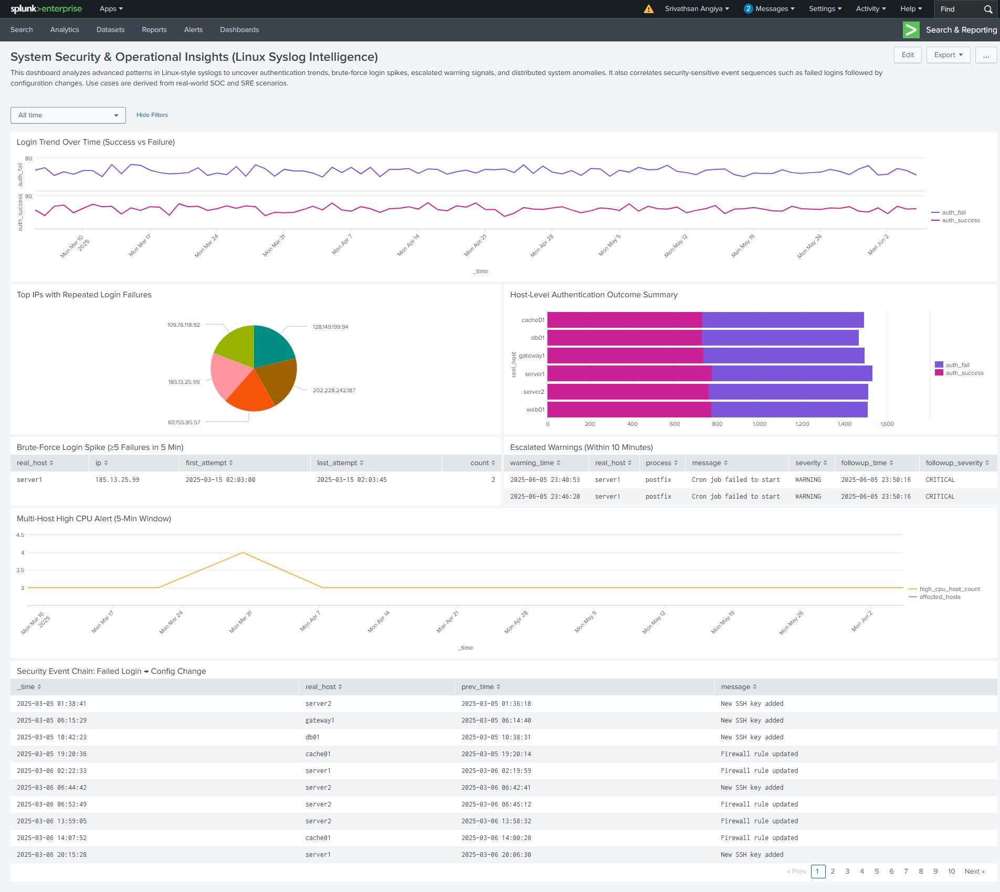

# System Security & Operational Insights (Linux Syslog Intelligence)

This project showcases a custom Splunk dashboard built to monitor simulated Linux server activity by analyzing synthetic syslog events. It highlights authentication trends, brute-force attack patterns, system-wide CPU anomalies, suppressed warnings that escalate, and chained security-sensitive behaviors. The goal is to simulate real-world SOC and SRE scenarios using correlated and classified log data from distributed systems.

---

## ✅ Use Case Summary

| Panel | Description |
|-------|-------------|
| **Login Trend Over Time (Success vs Failure)** | Visualize daily patterns in successful vs failed login attempts using lookup-driven classification. |
| **Top IPs with Repeated Login Failures** | Detect IP addresses that triggered more than 20 failed logins — potential brute-force sources. |
| **Host-Level Authentication Outcome Summary** | Compare authentication results (success/failure) across different hosts. |
| **Brute-Force Login Spike (≥5 Failures in 5 Min)** | Detect IPs that triggered 5+ failed login attempts on a single host within 5 minutes. |
| **Escalated Warnings (Within 10 Minutes)** | Identify warnings that were followed by ERROR/CRITICAL messages from the same process within 10 minutes. |
| **Multi-Host High CPU Alert (5-Min Window)** | Detect moments where multiple hosts reported high CPU usage within a tight window — useful for impact analysis. |
| **Security Event Chain (Failed Login → Config Change)** | Correlate events where failed logins were followed by SSH key additions or firewall changes from the same host within 10 minutes. |

---

## 📊 Dashboard Preview

---

## 🧾 Dashboard Source

The XML source of the dashboard (`dashboard_source.xml`) is placed **at the root** of this repository, alongside this README file.

---

## 📁 Folder Structure

- `scripts/`: contains the Python script that generated the synthetic syslog dataset.
- `lookup_data`: contains the CSV file that maps syslog messages to event types for classification
- `sample_data/`: contains the generated `.log` file uploaded into Splunk.
- `screenshots/`: optional folder with full and/or per-panel visuals.
- `queries/`: text files with saved SPL per panel for reference.

---

## 📘 About the Dataset

The data was generated using a custom Python script (`generate_linux_syslogs_advanced.py`) which produces realistic Linux-style syslog entries for use in Splunk. It supports use cases such as:

- Brute-force login bursts  
- Time-based escalation trails  
- Severity suppression simulation  
- Multi-host operational impact

The data supports advanced SPL scenarios like `streamstats`, `join`, `timechart`, `event classification via lookup`, and correlation via `eval`.

---

## 🚀 How to Use

1. Upload the provided `simulated_linux_syslog_advanced.log` to Splunk or Execute the Python script "generate_linux_syslogs_advanced.py"
2. Assign sourcetype: `custom_linux_syslog`
3. Apply regex field extraction for `real_host`, `process`, `severity`, `message`, and `ip`
4. Upload the dashboard XML file via: `Settings → Dashboards → Import XML`
5. Use `linux_syslog_message_eventtype_classification.csv` as a lookup to classify messages into event types

---

